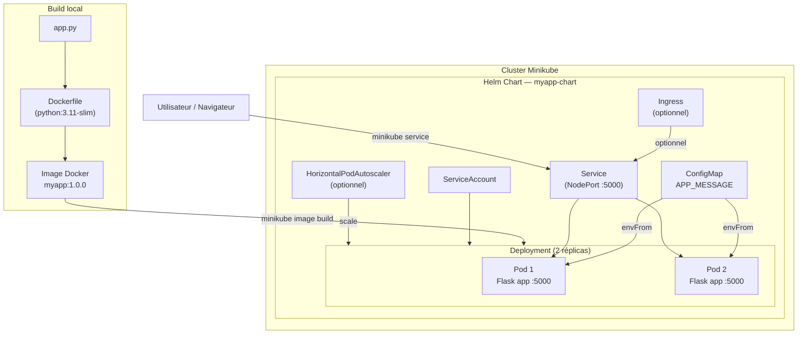

# Architecture



# Installation

1. Install [minikube](https://minikube.sigs.k8s.io/docs/start/)

2. Install [helm](https://helm.sh/docs/intro/install/)

3. Clone the repo:
```bash
git clone --depth 1 --branch main https://github.com/Todiq/kubernetes_training.git
```

4. Build the app:
```bash
minikube start && cd kubernetes_training && minikube image build -t myapp:1.0.0 .
```

5. Deploy the app:
```bash
helm install myapp ./myapp-chart
```

6. Access the app from the browser
```bash
minikube service myapp-myapp-chart
```

7. Dynamically update the displayed text:
```bash
helm upgrade myapp ./myapp-chart --set appConfig.message='Hello there!'
```

8. Rollback:
```bash
helm rollback myapp
```

9. Uninstall the app:
Kill the `minikube service myapp-myapp-chart` process, then run
```bash
helm uninstall myapp && minikube stop
```